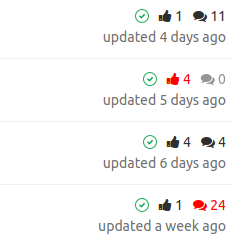

# Chrome extension : Gitlab CE merge requests review

## The problem

In big project, it's very difficult to see wich merge requests we have already commented or approved.

## The solution

A chrome/chromium extension to quickly see which merge request I've commented or approved. Like this :



The red icons are the ones I've commented or approved.

## Usage

### Install

```bash
git clone https://github.com/mRoca/chrome-extension-gitlab-mr-review.git
```
Then go to `chrome://extensions/` , activate the `Developer mode`, use the `Load unpacked extension...` button and select the cloned folder.

### Update

Go to the cloned folder, and run

```bash
git pull --rebase
```

Then go to `chrome://extensions/` and use the `Reload` button of the `Gitlab merge requests review` extension.

## Tech

* This extension works with Gitlab api v4 (`GitLab >= 8.9`).
* This extension only works with Gitlab CE : the approvals system of the EE is not used for now.
